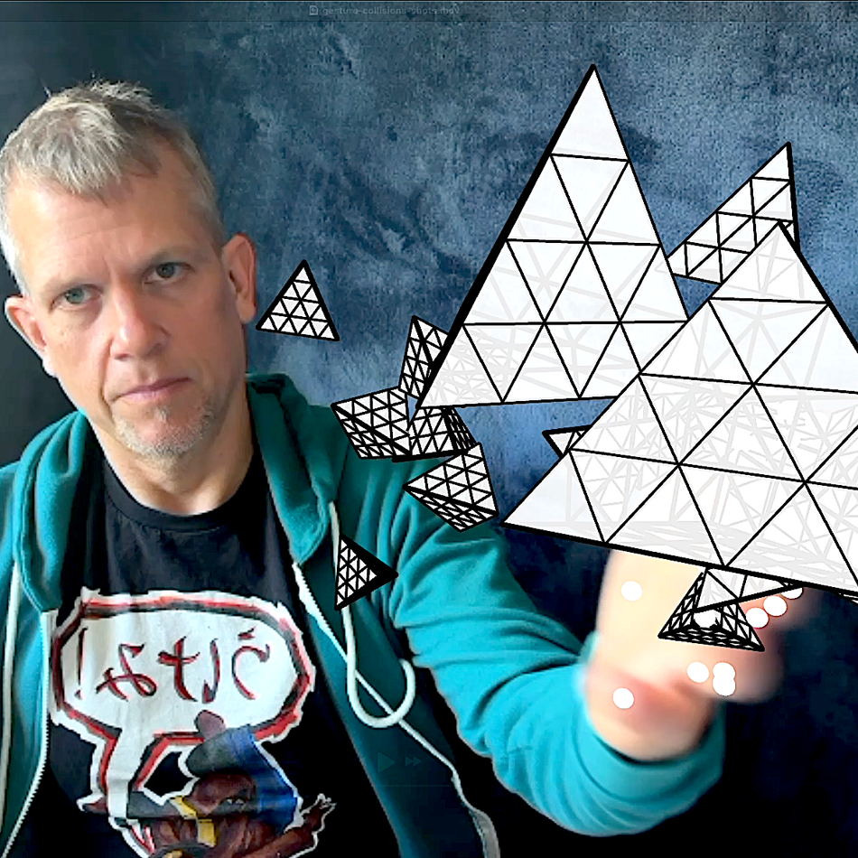

# Three.js Project: Your Hand = Controller

A liquid glass simulation using Three.js, Rapier Physics, and the Marching Cubes algorithm. Watch as metaballs glide and morph in real-time, reacting to mouse movement and invisible physics bodies behind the scenes.

✨ What You’ll Learn:

Setting up a realistic HDR-lit Three.js scene

Creating a transparent, refractive material for the “liquid glass” look

Using MarchingCubes to simulate organic, blobby forms

Integrating Rapier for physics-based interactions

Building a custom mouse-driven controller to move and deform the metaball mesh in real-time

Bonus: how to debug your physics simulation with Points!

Whether you're exploring creative code or just want to melt some glassy blobs in your browser, this is a fun and surprisingly powerful effect to add to your toolkit.

## Dependencies
- [Three.js](https://threejs.org/) (WebGPU Renderer, Orbit Controls)
- [Rapier Physics](https://rapier.rs/)

## Development
Modify `index.js` to experiment with different Three.js objects, materials, or effects.

## License
This project is licensed under the MIT License. Feel free to modify and distribute.

